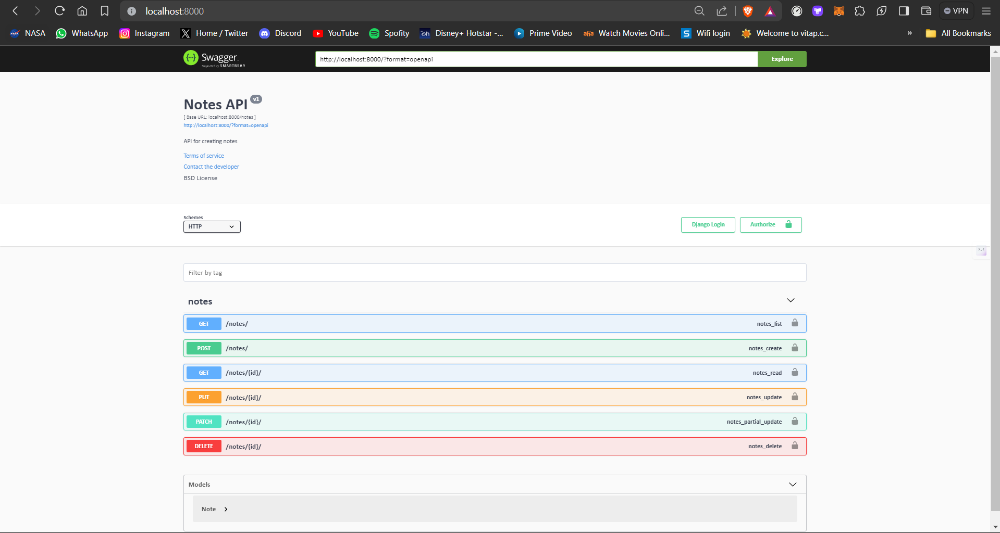

# You can see the endpoints when you start the application

# The swagger api documentation is added to this application

## Choice 1:

### Install docker and start the docker then

### open the folder and type

```shell
docker-compose build
```

### then 

```shell
docker-compose up
```

#### The application will be running on localhost:8000 port in your web browser


## Choice 2:

### Open the folder

```shell
cd env/Scripts
```

```shell
./activate
```

```shell
cd ../..
```

```shell
pip install -r "requirements.txt"
```

```shell
python manage.py makemigrations
```

```shell
python manage.py migrate
```

```shell
python manage.py runserver
```

#### The application will be running on 127.0.0.1:8000 in your web browser


### next time you try to run this application no need of all this just activate the environment

```shell
cd env/Scripts
```

```shell
./activate
```

```shell
cd ../..
```

then

```shell
python manage.py runserver
```

The application will be running on 127.0.0.1:8000 in your web browser


