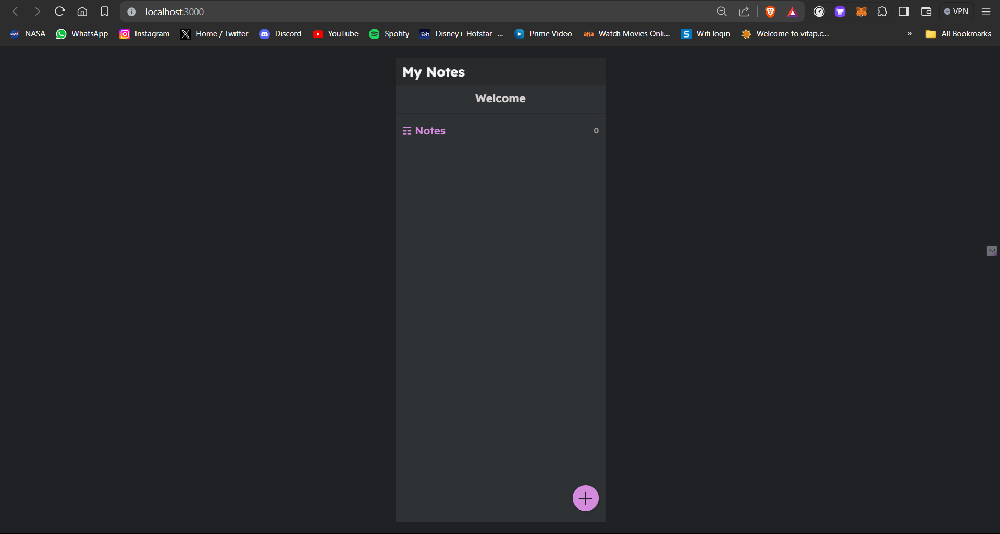
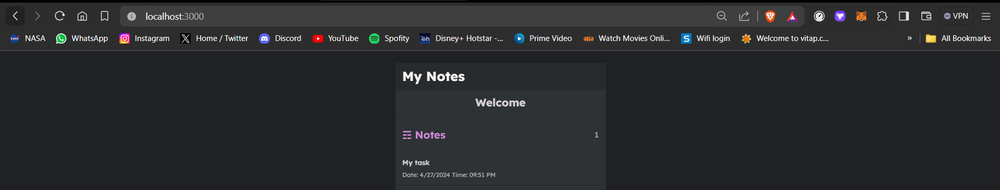
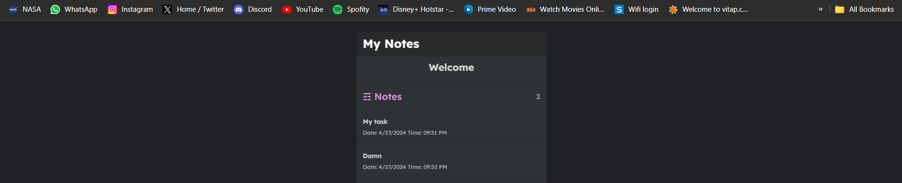

# Running from cmd would be preferred over terminal

You can see the endpoints when you start the application

The swagger api documentation is added to this application You can see API documentation on 127.0.0.1:8000/swagger/ if using docker

```bash
127.0.0.1:8000/swagger/
```

Due to migration error in docker configuration file I have removed it

```

Please run the code manually

Database configuration

python```
DATABASES = {
    'default': {
        'ENGINE': 'django.db.backends.postgresql',
        'NAME': 'task_app',
        'USER': 'surya',
        'PASSWORD': '123',
        'HOST': '127.0.0.1',
        'PORT': '5432',
    }
}
```


=======
#### The application will be running on localhost:8000 port in your web browser


## Choice 2:

### Open the folder

```shell
cd env/Scripts
```

```shell
./activate
```

```shell
cd ../..
```

```shell
pip install -r "requirements.txt"
```

```shell
python manage.py makemigrations
```

```shell
python manage.py migrate
```

```shell
python manage.py runserver
```

#### The application will be running on 127.0.0.1:8000 in your web browser


### next time you try to run this application no need of all this just activate the environment

```shell
cd env/Scripts
```

```shell
./activate
```

```shell
cd ../..
```

then

```shell
python manage.py runserver
```

The application will be running on 127.0.0.1:8000 in your web browser


Open frontend folder(Install React)

```bash
cd frontend
```

```bash
set NODE_OPTIONS="--openssl-legacy-provider"
```

```bash
npm install
```

```bash
npm start
```

The application will be running on localhost:3000 in your web browser








